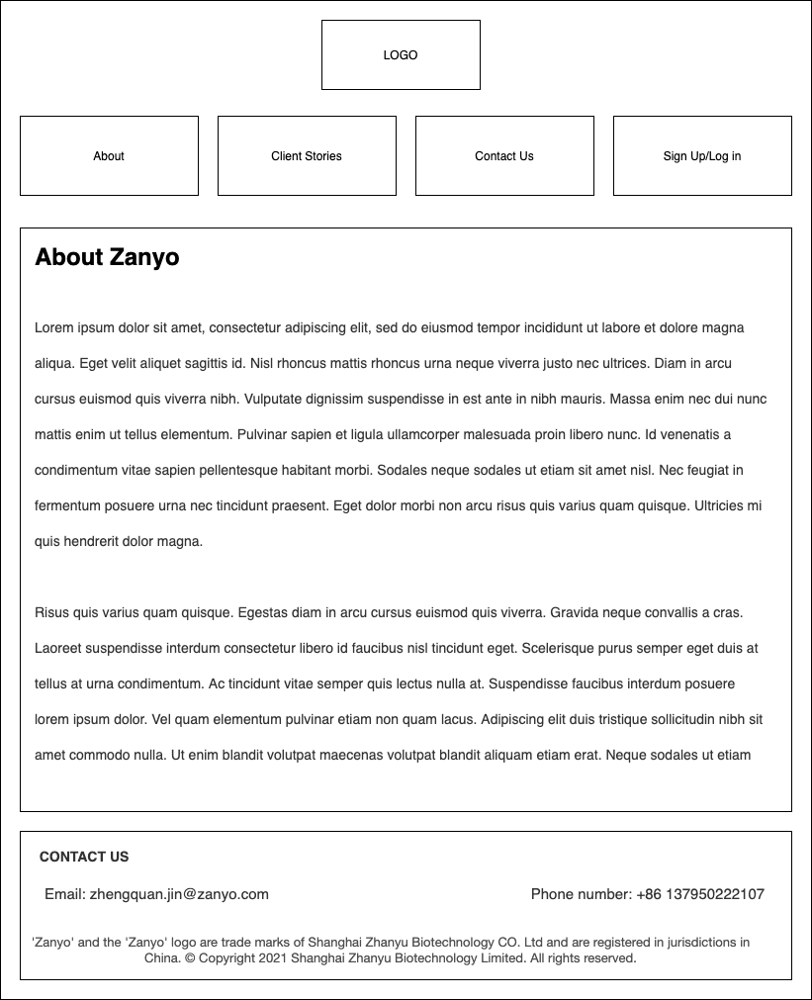
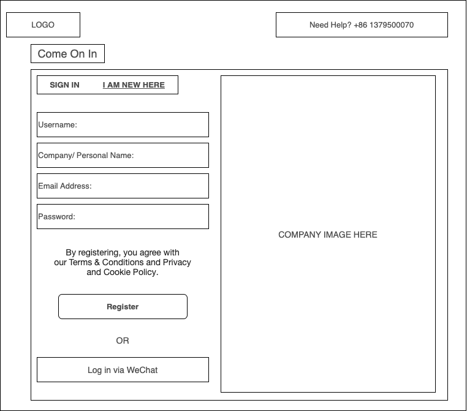
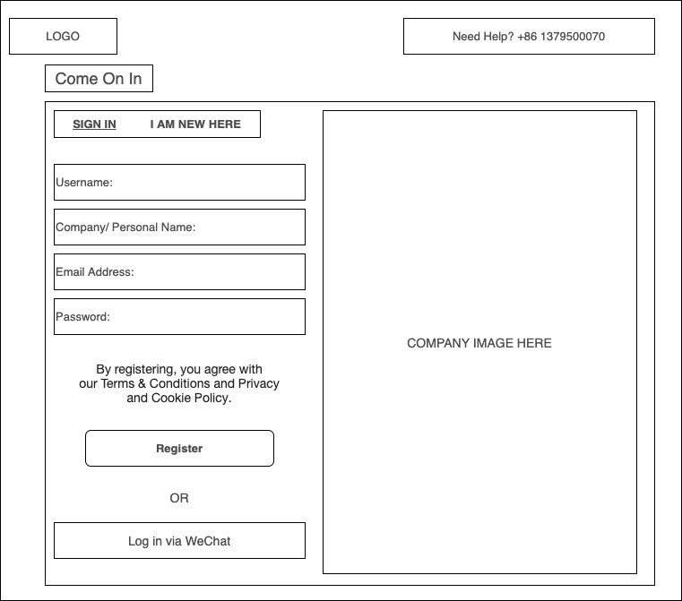
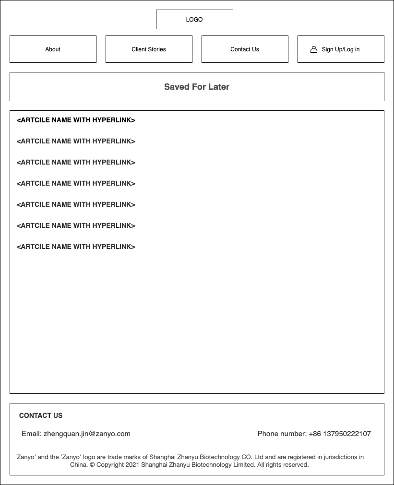
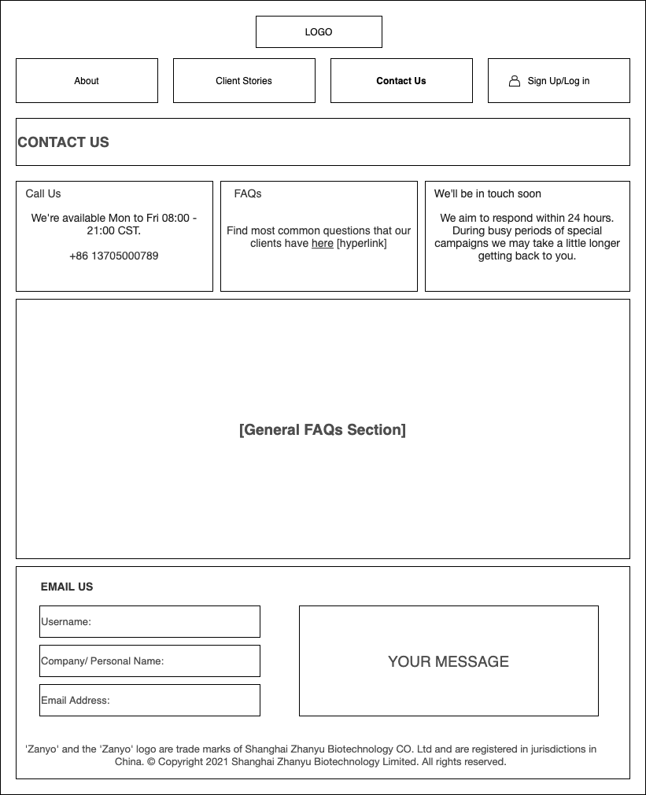
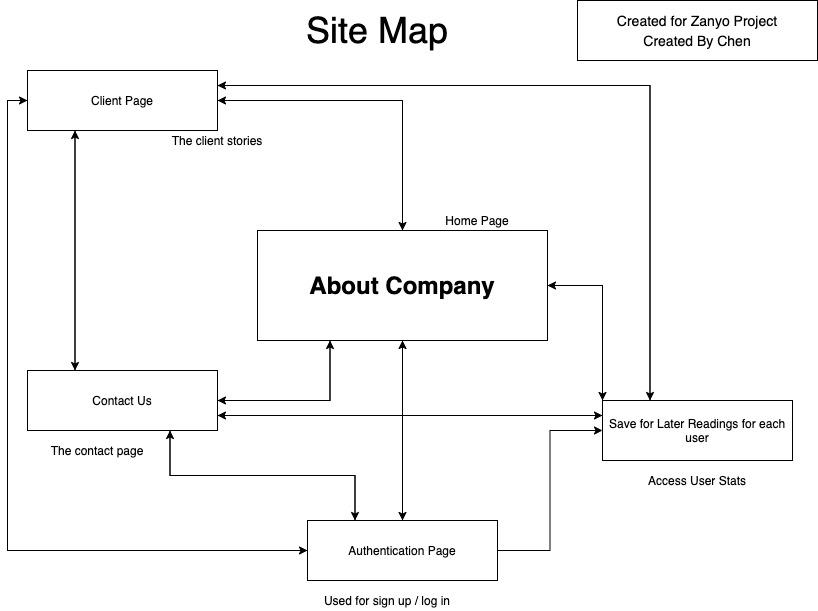

# Zanyo Company Website

## Overview

This project is a company website for Zanyo which focuses on chemical engineering field and mainly targets industries/factories.

In the past, most of Zanyo's marketing and sales strategies are done with the "word of mouth" and with its intention to expand,
the goal for this website is to provide a platform for both people in the same industry and for clients who are interested
in their products to know better about Zanyo's culture.

## Data Model

The application will store:

- username
- user's company name/personal name
- user's email address
- user's contact number -> mobile number

Schema 2:

- user's request message

Schema 3:

- user's comment

An Example User:

```javascript
{
  username: "zanyo_ltd",
  name: "Shanghai Zanyo Biotechnology Co. Ltd",
  email: "zhenquan.jin@zanyo.com",
  phone: "+86 13705077700",
}
```

## [Link to Commented First Draft Schema](db.js)

## Wireframes

/ - page about Zanyo Company



<!-- /signup - page for user signup



/signin - page for log in

 -->

/client - page for client culture information


/articles - user saved urls for later reading articles



/contact - contact page



## Site map



## Updated:

- The final deployment has some variations from this version which includes:
  - Updated Functionalities:
    - `sponsor` which lists all the enrolled sponsors
    - `request support page` which allows user to send messages to us
    - `comment page` which functions as an open forum

## User Stories or Use Cases

(**\_TODO**: write out how your application will be used through [user stories](http://en.wikipedia.org/wiki/User_story#Format) and / or [use cases](https://www.mongodb.com/download-center?jmp=docs&_ga=1.47552679.1838903181.1489282706#previous)\_)

1. as user/non-registered user, I can read about the company
2. as user/non-registered user, I can submit contact informations to the company
3. as user/non-registered user, I can enroll in the sponsor list for the company
4. as user/non-registered user, I have access to the company's sponsor listings
5. as user/non-registered user, I can send request forms/messages
6. as user/non-registered user, I can share messages on the comments section

## Research Topics

- (6 points) react.js
  - used react.js as the frontend framework;
- (2 points) Use a CSS framework for my site \* use Boostrap to create stylings
- (1 points) Use Google Map on the footer section of sites
- (1 points) Use Heroku and Atlas to deploy application
- (1 points) Use external toolkit fontawesome which is based on CSS and Less to embed icons
  11 points total out of 8 required points

## [Link to Initial Main Project File](app.js)

(**\_TODO**: create a skeleton Express application with a package.json, app.js, views folder, etc. ... and link to your initial app.js\_)

## Annotations / References Used

(**\_TODO**: list any tutorials/references/etc. that you've based your code off of\_)

1. Mozilla tutorial on react
2. Heroku deployment Documentation [https://dashboard.heroku.com/apps/zanyo-heroku-deployment/metrics]
3. Esterling Accime's tutorial on mern
4. debug for heroku deployment [https://www.youtube.com/watch?v=xxua85cCiT0]
5. css styling from mozilla [https://developer.mozilla.org/zh-CN/docs/Web/CSS/border-collapse]
6. react-boostrap documentation [https://react-bootstrap.github.io/components/navbar/]
7. react-boostrap installation [https://react-bootstrap.github.io/getting-started/introduction/]
8. creating company logo [https://studio.tailorbrands.com/brands/6374630736/downloads]
9. youtube tutorial for running server and client on the same terminal [https://www.youtube.com/watch?v=1REonFsWBbY]
10. youtube tutorial for running server and client on the same terminal [https://www.youtube.com/watch?v=kJA9rDX7azM]
11. react blog [https://linguinecode.com/post/understanding-react-componentdidmount]
12. react component documentation [https://reactjs.org/docs/react-component.html]
13. solving mongodb connection issue [https://1password.community/discussion/121810/node-js-client-typeerror-err-invalid-url-invalid-url]
14. mongodb invalid url issue [https://stackoverflow.com/questions/56886875/typeerror-invalid-url]
15. mongodb atlas documentation [https://docs.atlas.mongodb.com/tutorial/create-new-cluster/]
