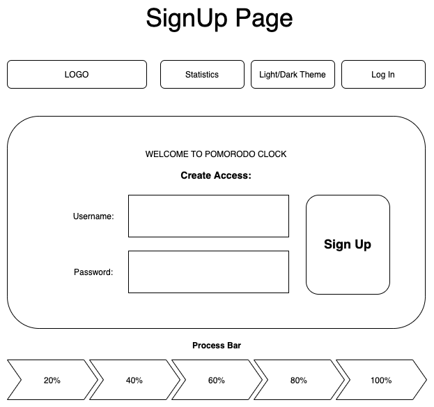
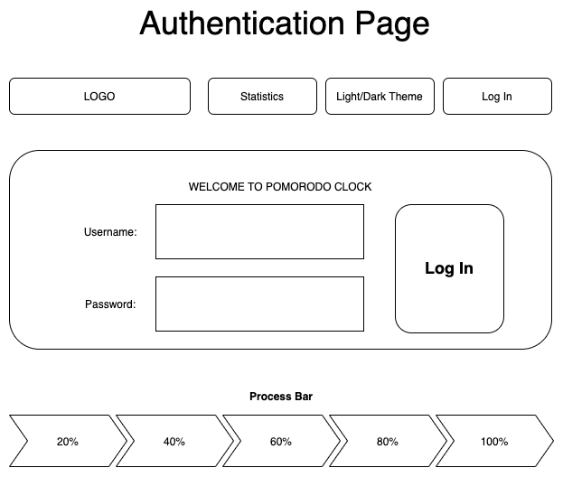
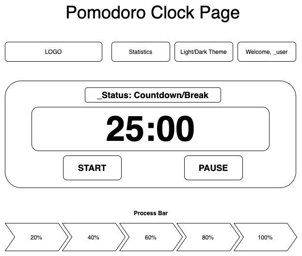
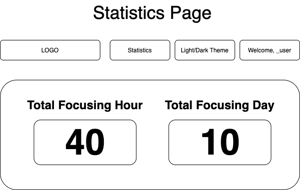
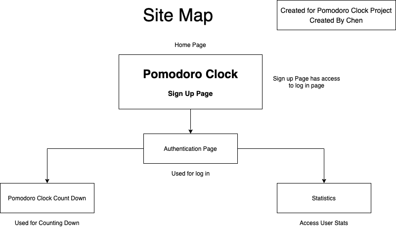

# Pomodoro Clock

## Overview

Pomodoro Clock provides a countdown clock with concise user interface of which ensures efficient focusing countdowns of around 25 minutes with a 5 minutes break.

Pomodoro Clock is a web app that will allow users to customize countdown ranging up to 25 minutes with a five-minute break by incorporating the Pomodoro technique.

It will also provide a summary of the user's activity summary.

This web app incorporates the time management method invented by Francesco Cirillo in the 80s.

## Data Model

The application will store Users, FocusTime and Theme, hash, Items

* users can set their preference for the theme of their pomodoro clock
* each user has a tracked focus time for their accumulated working hours
* hash for each user's password authentication
* each FocusTime can have multiple items (by embedding)

An Example User:

```javascript
{
  username: "chenJ",
  hash: ,// a password hash,
  theme: ,//dark or light themed
  FocusTime: // an array reference
}
```

An Example List with Embedded Items:

```javascript
{
  user: // a reference to a User object
  items: [
    { start: "20130623T13:22-0500", set: 25, shortBreak: true},
    { start: "20140623T13:22-0500", set: 10, shortBreak: true},
  ]
}
```

## [Link to Commented First Draft Schema](db.js) 

## Wireframes

/ - page for user signup (can have access to the log in page)



/login - page for showing the pomodoro countdown



/clock - page for showing the pomodoro countdown



/clock/stat



## Site map



## User Stories or Use Cases

(___TODO__: write out how your application will be used through [user stories](http://en.wikipedia.org/wiki/User_story#Format) and / or [use cases](https://www.mongodb.com/download-center?jmp=docs&_ga=1.47552679.1838903181.1489282706#previous)_)

1. as non-registered user, I can register a new account with the site
2. as a user, I can log in to the site
3. as a user, I can use Pomodoro Clock timer and pause
4. as a user, I can view my countdown process through a process bar
5. as a user, I can view all of my past statistics

## Research Topics

* (5 points) Integrate user authentication
    * using passport for user authentication
    * account has been made for testing
    * see <code>cs.nyu.edu/~jversoza/ait-final/register</code> for register page
    * see <code>cs.nyu.edu/~jversoza/ait-final/login</code> for login page
* (5 points) react.js
    * used react.js as the frontend framework;
* (2 points) Use a CSS framework for my site
    * use Boostrap to create the styling for all the Pomodoro Sites
10 points total out of 8 required points


## [Link to Initial Main Project File](app.js) 

(___TODO__: create a skeleton Express application with a package.json, app.js, views folder, etc. ... and link to your initial app.js_)

## Annotations / References Used

(___TODO__: list any tutorials/references/etc. that you've based your code off of_)

1. [passport.js authentication docs](http://passportjs.org/docs) - (add link to source code that was based on this)
2. [tutorial on vue.js](https://vuejs.org/v2/guide/) - (add link to source code that was based on this)

